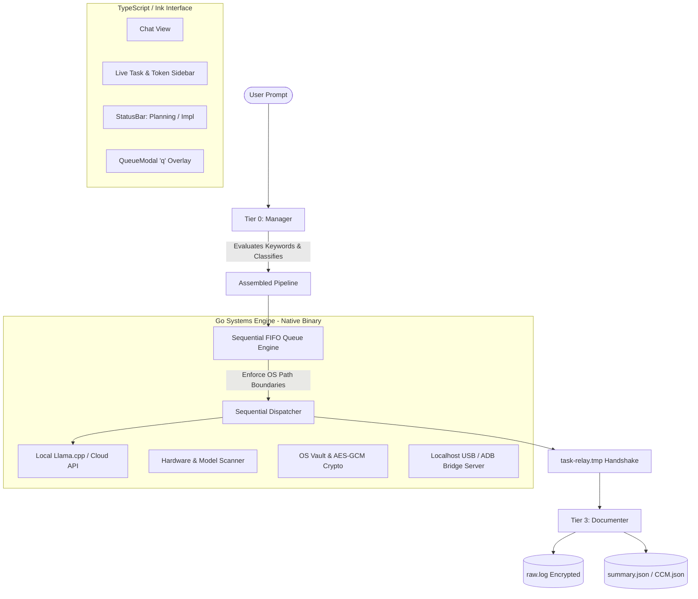

# Vecta System Architecture & Technical Specification

> The canonical, exhaustive architecture manual for Vecta: a local-first, multi-agent CLI developer productivity tool.
> Synthesized directly from all 26 Claude Architecture Docs and the Sprint Plan rulings.

---

## 1. System Overview & Philosophy

Vecta orchestrates specialized local and cloud AI roles into a strictly sequential developer workflow. It runs entirely on the developer's workstation without requiring cloud backends, account registrations, or Docker dependencies.



### Non-Negotiable Core Laws
1. **Strictly Sequential Execution:** No parallel agent runs. Ever. Exactly one role executes at a time.
2. **Local-First & Zero Accounts:** All configuration, session history, and memory reside in `.vecta/`.
3. **One-Way IPC Boundary:** TypeScript controls the interface and calls Go via subprocess JSON over standard input/output (`stdio`). Go **never** calls TypeScript directly.
4. **Docs & Sprint Plan Precedence:** Where a specification and reality disagree, `Sprint Plan.md` wins.

---

## 2. Technical Stack & Language Split

| Layer | Technology | Primary Responsibilities |
|---|---|---|
| **Terminal Frontend** | **TypeScript 5.8** + **Ink 5** + **React 18** | Terminal UI rendering (Yoga flexbox), 9 role prompts, slash commands, application state (`config`, `session`, `memory`, `relay`, `manager-duties`), token usage UI. |
| **Bundling & Packaging** | **esbuild** + **bun compile** | Bundles interface into a single self-contained executable with embedded runtime. No Node.js required on user machines. |
| **Systems Backend** | **Go 1.27** | Statically linked native binary (`vecta-engine`). Hardware scanning (RAM, VRAM, GPU), runtime probes (ports 11434, 1234, 8080), `.gguf` lifecycle (spawn/stop), path boundary enforcement, OS vault crypto, sequential queue dispatch, USB/ADB device bridge. |
| **Footprint Target** | **< 80 MB total** | Final distribution consists of exactly two binaries: the UI executable and the Go systems binary. |

---

## 3. Subprocess JSON stdio Bridge Protocol

TypeScript spawns `vecta-engine` and exchanges single-line JSON messages over standard input and output:

### Request Contract (TypeScript $\rightarrow$ Go via stdin)
```typescript
export type BridgeRequest =
  | { id: string; action: "ping"; payload?: Record<string, never> }
  | { id: string; action: "scan_hardware"; payload?: Record<string, never> }
  | { id: string; action: "scan_models"; payload?: { customPaths?: string[] } }
  | { id: string; action: "queue_dispatch"; payload: { taskId: string; role: string; filePaths: string[] } }
  | { id: string; action: "crypto_encrypt"; payload: { plaintext: string; keyId?: string } }
  | { id: string; action: "crypto_decrypt"; payload: { ciphertext: string; keyId?: string } }
  | { id: string; action: "device_status"; payload?: Record<string, never> };
```

### Response Contract (Go $\rightarrow$ TypeScript via stdout)
```typescript
export type BridgeResponse<T = unknown> = {
  id: string;
  success: boolean;
  data?: T;
  error?: string;
};
```

---

## 4. Operational Modes (Planning vs. Implementation)

Modes are toggled instantly with the **`Tab`** key without confirmation dialogs:

### Planning Mode
- **Active Roles:** Manager, Planner, and Reviewer (non-code advisory capacity).
- **Idle Roles:** Builders, Checkers, and Documenter remain completely idle.
- **Purpose:** Architecture brainstorming, task breakdown, and technical planning. No code files are modified.

### Implementation Mode
- **Active Roles:** Full pipeline (Manager dispatches to Builders, Checkers, and Documenter).
- **Behavior:** Cold user requests assemble pipelines dynamically. Switching to Planning mode pauses active tasks; switching back resumes them immediately.

---

## 5. Interface Layout & Screens (Doc 05 & Doc 06)

The terminal UI is divided into 3 primary view areas plus an overlay modal:

```
┌─────────────────────────────────────────────────────────┬──────────────────────┐
│ Chat Interaction View                                   │ Live Task & Metrics  │
│                                                         │                      │
│ [User]: Add JWT auth to the API endpoints               │ Session Tokens:      │
│ [Manager]: Assembled pipeline:                          │ 4,120 / 10,000       │
│   1. Backend Engineer (auth logic)                      │                      │
│   2. Security Checker (credential review)               │ Active Tasks:        │
│   3. Documenter (audit log)                             │ [✓] 1. Backend Eng   │
│                                                         │ [●] 2. Security Chk  │
│ [Backend Engineer]: Implemented auth.go with HMAC-SHA256│ [ ] 3. Documenter    │
│                                                         │                      │
└─────────────────────────────────────────────────────────┴──────────────────────┘
│ [Tab] Planning Mode  |  [q] Queue  |  [Ctrl+→] Open Sidebar  |  [/help] Commands │
└────────────────────────────────────────────────────────────────────────────────┘
```

### UI Components
1. **Chat (`interface/src/components/Chat.tsx`):** Displays scrolling interaction log, role thoughts, and system notices.
2. **Sidebar (`interface/src/components/Sidebar.tsx`):**
   - **Widget 1 (Tokens):** Live task token usage counter against fixed caps (Cap 1: 10,000 / Cap 2: 100,000). Counter resets to 0 at the start of each task (Sprint Plan §2K).
   - **Widget 2 (Tasks):** Live pipeline progress list (`[✓]` done, `[●]` active, `[ ]` queued).
   - **Shortcuts:** **`Ctrl+→`** opens the sidebar, **`Ctrl+←`** closes it (Sprint Plan §2L).
3. **StatusBar (`interface/src/components/StatusBar.tsx`):** Displays active mode (`PLANNING` or `IMPLEMENTATION`), model indicator, and hotkey hints.
4. **QueueModal (`interface/src/components/QueueModal.tsx`):** Full-screen overlay toggled by pressing **`q`** to inspect pending tasks.

---

## 6. Complete Slash Command Matrix

| Command | Description | Specification |
|---|---|---|
| **`/agent roles`** | Interactive roster to toggle roles `[on]`/`[off]` and drill down into model assignments (local/cloud) and Layer 2 safety toggles. Includes "Rescan models" button. | Doc 05, Doc 21, Sprint Plan §2U |
| **`/prompt`** | Custom instructions editor per role (max 300 words per Sprint Plan §5) and color palette picker. | Doc 06, Doc 21 |
| **`/chats`** | List, switch, rename, pin, or delete conversation sessions. | Doc 05, Doc 12 |
| **`/projects`** | Workspace project manager binding chats to local directory scopes. | Doc 05, Doc 13 |
| **`/queue`** | Detailed inspector for active and pending queue tasks. | Doc 05, Doc 07 |
| **`/memory`** | Editor for Tier 2 memory (Key Points and rolling narrative). | Doc 05, Doc 12, Doc 13 |
| **`/settings`** | Global settings (theme, timeouts, raw log size cap, auto-delete intervals). | Doc 05, Doc 14 |
| **`/usage`** | Daily token breakdown per model. | Doc 05, Doc 19 |
| **`/token-weekly`** | Weekly token consumption analytics. | Doc 05, Doc 19 |
| **`/help`** | Command index and keyboard shortcut cheatsheet. | Doc 06 |
| **`/lock`** | Locks the current session immediately. | Doc 16 |
| **`/exit` / `/quit`** | Exits the Vecta CLI cleanly (Sprint Plan §2O). | Sprint Plan §2O |

---

## 7. Storage Hierarchy & Schemas (`.vecta/`)

Vecta uses a strictly localized storage architecture:

```
.vecta/
├── config.json                      → Global user config & role assignments
│
├── memory/
│   ├── general.json                 → Global pinned preferences across all scopes (Sprint Plan §2E)
│   └── CCM.json                     → Cross-Chat Memory per scope (General + Projects)
│
├── chats/
│   └── [chat-id]/
│       ├── meta.json                → Name, creation date, bound project ID
│       ├── raw.log                  → AES-GCM encrypted ring buffer (256MB cap, 2-wk auto-delete)
│       ├── summary.json             → 350-word rolling narrative + bulleted Key Points
│       ├── task-relay.tmp           → Active task handoff file (cleared per task)
│       └── manager-duties.json      → Layer 1 base duties + Layer 2 chat additions
│
└── projects/
    └── [project-id]/
        ├── meta.json                → Project name and root path
        └── chat-refs.json           → Ordered list of associated chat IDs
```

### The Exact Memory Tiers (Sprint Plan §2E)
- **`general.json`:** Global preferences shared across all scopes. Never auto-compacted.
- **`summary.json`:** One per chat. Contains a rolling narrative (**350-word cap**) plus bulleted **Key Points**.
- **`CCM.json`:** Cross-Chat Memory. One per scope (general scope + each project scope). Rolling narrative (**700-word cap**) plus cross-chat Key Points.

---

## 8. Canonical Sprint Plan Rulings Index

| Ref | Conflict in Older Specs | Canonical Sprint Ruling (Winning Decision) |
|---|---|---|
| **§2D** | Autonomy modes: 3 tiers vs 2 tiers | **Two modes only: Off / Full.** Confirm mode is removed. |
| **§2E** | Memory files: varying names and tiers | **Exactly 3 files: `general.json`, `summary.json`, `CCM.json`.** |
| **§2F** | Custom roles: authoring `.ts` at runtime | **JSON registry loaded at runtime.** No runtime TypeScript authoring. |
| **§2G** | Handshake: postponed design passes | **Single file `task-relay.tmp` with Documenter copy/flush handshake.** Built now. |
| **§2H** | Raw log cap & compaction | **Default cap: 256 MB (max 1 GB).** Compress first; prune oldest entries once lossy. |
| **§2I** | Inactivity auto-delete | **2 weeks of inactivity.** Timer resets on every file access. |
| **§2J** | Hash loop detection | **Hash full output text. 3 identical in a row = loop.** Manager retries 3x. |
| **§2K** | Token counter reset | **Resets to 0 at the start of each task.** |
| **§2L** | Sidebar keyboard shortcuts | **Ctrl+→ opens sidebar; Ctrl+← closes it.** |
| **§2M** | Role classification matching | **Keyword/file-path matching first.** Lightweight Manager classification call only for custom/ambiguous. |
| **§2N** | Dispatch brief schema | **`task-relay.tmp` temporarily extended during dispatch** to carry instructions, limits, and file paths; reverts to normal after read. |
| **§2O** | CLI exit mechanism | **`/exit` and `/quit` commands built directly into shell.** |
| **§2P** | Documenter mode behavior | **Documenter is passive, always.** Operates in both Planning and Implementation modes. |
| **§2Q** | Reviewer role dual-nature | **Implementation mode: checks code. Planning mode: reviews architecture & ideas.** |
| **§2B** | Raw log decrypt inspection | **Documenter decrypts to local file on disk; user opens in editor. NEVER paste raw log into CLI/chat.** |
| **§2U** | Model catalog & lifecycle | **Merged catalog (running servers + on-disk `.gguf` files). Spawns/stops `llama.cpp` on `127.0.0.1:8080` on demand.** |
| **§3** | Vecta Device demo | **Go device server bound to `127.0.0.1` + `adb reverse` to Android emulator.** Physical cable is post-MVP. |
