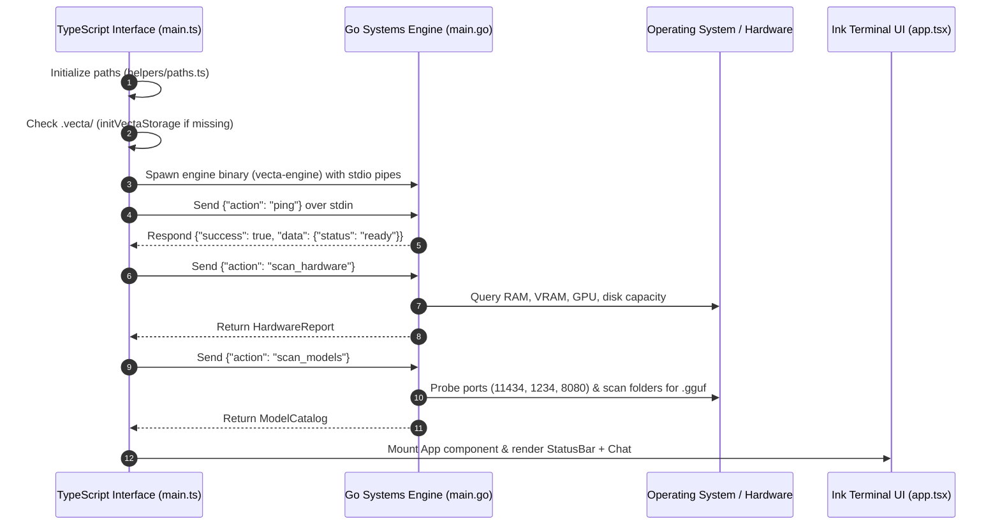
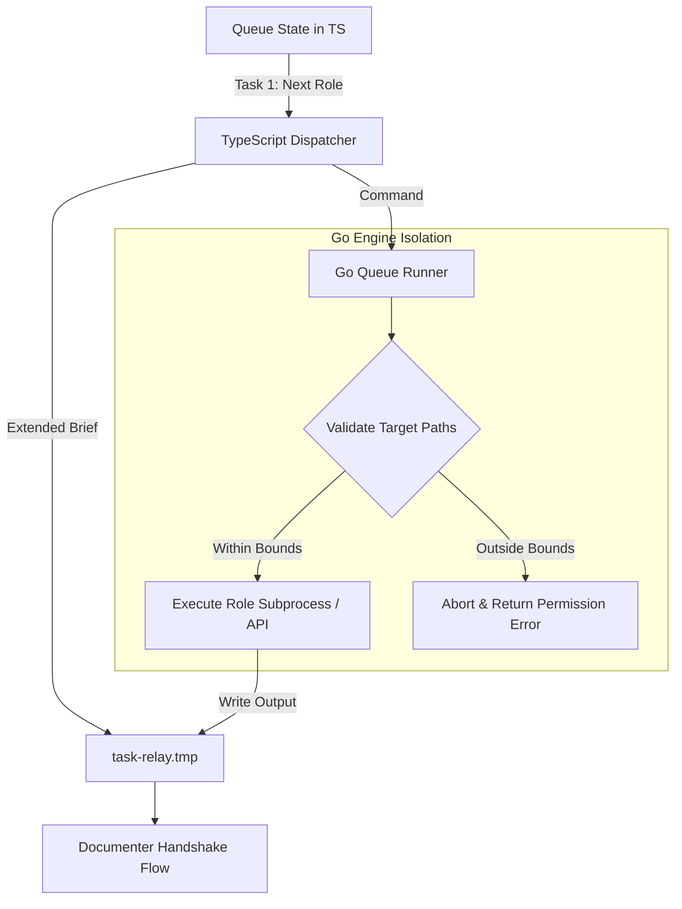
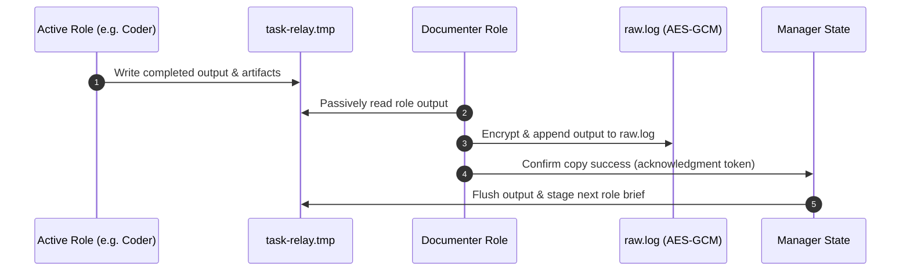
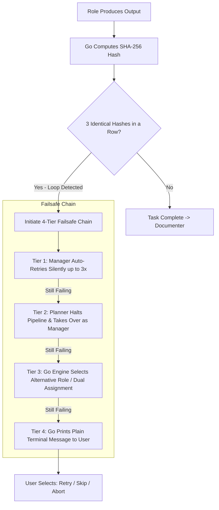

# Vecta Execution Flows & Function Specifications

> The complete architectural flow manual detailing every step-by-step system execution sequence in Vecta.
> Synthesized from Docs 07, 08, 09, 10, 11, 12, 13, 18, 19, 22, 23, and 26.

---

## Flow 1: Startup, Hardware Scan & Bridge Handshake



---

## Flow 2: Cold Prompt to Dynamic Pipeline Assembly

1. **User Input:** User submits prompt in Implementation Mode.
2. **Keyword & Path Evaluation (Sprint Plan §2M):**
   - Manager checks enabled roles against keyword patterns:
     - `auth`, `login`, `database` $\rightarrow$ **Backend Engineer**
     - `component`, `button`, `css` $\rightarrow$ **Frontend Engineer**
     - `password`, `key`, `crypto` $\rightarrow$ **Security Checker**
3. **Ambiguity Resolution:** If unassigned or custom roles match, Manager runs a single internal classification query.
4. **Pipeline Sorting:** Selected roles are ordered strictly by functional tier:
   $$\text{Stage 1 (Builders)} \longrightarrow \text{Stage 2 (Checkers)} \longrightarrow \text{Stage 3 (Documenter)}$$
5. **Sidebar Sync:** Pipeline is pushed to the Queue state and displayed on the Sidebar checklist.

---

## Flow 3: Sequential Queue Execution & Path Boundaries



- **Sequential Law:** Queue runner dispatches one task at a time. Concurrency is strictly prohibited.
- **Filesystem Boundaries:** Go verifies that all file read/write operations by the active role remain within the directories designated in the Manager's brief.

---

## Flow 4: Role Handoff & `task-relay.tmp` Handshake (Sprint Plan §2N, §2G)

### The Extended Dispatch Brief
During dispatch, `task-relay.tmp` is temporarily extended with the full context:
```json
{
  "taskId": "task-001",
  "role": "backend-engineer",
  "userPrompt": "Add JWT authentication to /api/login",
  "managerPlan": "Implement HMAC-SHA256 signing and bearer token verification",
  "rolePrompt": {
    "defaultPrompt": "You are the Vecta Backend Engineer...",
    "customInstructions": "Use standard crypto library only"
  },
  "fileBoundaries": ["source/engine/auth/"],
  "targetFiles": ["source/engine/auth/jwt.go"],
  "memorySnippets": ["User prefers standard library over external JWT packages"],
  "previousOutput": null
}
```

### The 4-Step Handshake Protocol

*Note:* After the role consumes the brief, `task-relay.tmp` reverts to its standard compact structure.

---

## Flow 5: Memory Lifecycle & Compaction (Sprint Plan §2E)

Vecta maintains exactly three memory files across the system:

```
┌────────────────────────────────────────────────────────┐
│ general.json                                           │
│ Global user preferences across all chats and projects. │
│ Never auto-compacted. Read on every session start.    │
└────────────────────────────────────────────────────────┘
                           ▲
                           │ Updates on persistent decisions
┌──────────────────────────┴─────────────────────────────┐
│ summary.json (Per Chat)                                │
│ Rolling narrative capped at 350 words.                 │
│ Bulleted Key Points capturing architectural decisions. │
└────────────────────────────────────────────────────────┘
                           ▲
                           │ Scoped persistence
┌──────────────────────────┴─────────────────────────────┐
│ CCM.json (Cross-Chat Memory per Scope)                 │
│ One per scope: General Standalone + Each Named Project.│
│ Rolling narrative capped at 700 words.                 │
└────────────────────────────────────────────────────────┘
```

1. **Per-Turn Roll:** Documenter folds new events from `task-relay.tmp` into `summary.json`.
2. **Word Cap Enforcement:** If `summary.json` narrative exceeds 350 words, Documenter condenses the oldest narrative sections into concise summaries.
3. **Cross-Chat Propagation:** Reusable project patterns are promoted to `CCM.json` under the active project scope.

---

## Flow 6: Token Usage Tracking & Sidebar Reset (Sprint Plan §2K)

- **Cloud Roles:** Token usage is parsed directly from API response headers/payloads.
- **Local Roles:** Estimated via local tokenizer approximation.
- **Per-Task Reset (Sprint Plan §2K):** The sidebar task token counter **resets to 0 at the start of each task**.
- **Caps:**
  - **Cap 1 (Warning):** 10,000 tokens per task.
  - **Cap 2 (Hard Limit):** 100,000 tokens per task.

---

## Flow 7: Hash Loop Detection & 4-Tier Failsafe Chain (Sprint Plan §2J, §4)



---

## Flow 8: Model Lifecycle Management (Sprint Plan §2U)

1. **Local GGUF Dispatch:** When a role assigned to a local `.gguf` model is called:
   - Go engine checks if `llama.cpp` is running on `127.0.0.1:8080`.
   - If not running, Go spawns `llama.cpp` pointing to the designated `.gguf` file.
2. **Execution:** The role sends inference queries to `127.0.0.1:8080`.
3. **Teardown:** When the role finishes:
   - If the role is the **Manager**, the model stays loaded (best-effort hot keep).
   - For all other roles, Go immediately terminates the `llama.cpp` process to free RAM and VRAM for the next role.

---

## Flow 9: Vecta Device Server & Emulator Bridge (Sprint Plan §3)

1. **Host Server:** Go engine spawns an HTTP/WebSocket server bound strictly to `127.0.0.1:8765` (never `0.0.0.0`, never wifi).
2. **ADB Reverse Tunnel:** TypeScript triggers `adb reverse tcp:8765 tcp:8765` to tunnel the port to the Android emulator.
3. **Android Client Sync:**
   - Client connects over localhost socket.
   - Displays real-time chat messages and live task checklist.
   - Allows toggling roles `[on]`/`[off]` and syncing `/prompt` additions back to the desktop CLI.
4. **Disconnection Handling:** If the emulator disconnects or the reverse socket drops, the queue automatically pauses and enters a reconnect grace window.
