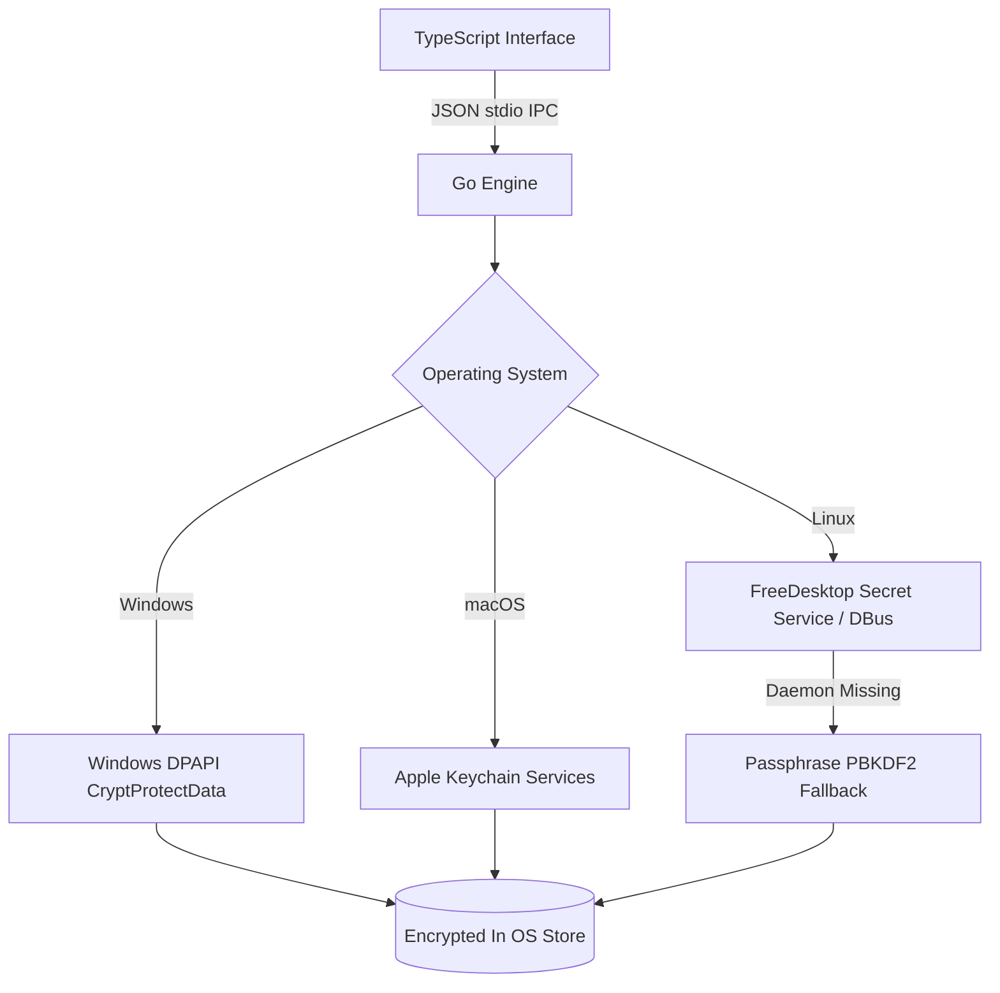

# Vecta Privacy & Security Specification

> The authoritative specification of Vecta's 5-point privacy model, native OS credential vault storage, AES-GCM at-rest encryption, zero-leak logging, and threat models.
> Synthesized from Docs 14, 15, 16, 25, and Sprint Plan rulings.

---

## 1. The 5-Point Privacy Model

1. **100% Local-First Storage:** All chats, project references, configurations, and memories reside in the local `.vecta/` directory. Vecta has zero central servers, collects no analytics, and requires no user accounts.
2. **Native OS Credential Protection:** API keys for external models (OpenAI, Anthropic, etc.) are never stored in plaintext JSON or config files. They are encrypted and retrieved via native OS vault APIs:
   - **Windows:** Microsoft Data Protection API (DPAPI) via `CryptProtectData`.
   - **macOS:** Apple Keychain Services via `SecItemAdd` / `SecItemCopyMatching`.
   - **Linux:** FreeDesktop Secret Service via D-Bus (with a passphrase-derived PBKDF2/AES key fallback).
3. **Outbound Data Isolation:** If a role uses a cloud model, only that role's immediate task brief leaves the local machine. Whole chat logs, unreferenced files, and other roles' memories are never included.
4. **Secret Scrubbing & Never-Log Rules:** The Documenter role actively strips tokens, API keys, passwords, and environment secrets before persisting text to logs or summaries. In the Go engine, sensitive cryptographic byte slices are zeroed immediately after use.
5. **Encrypted At-Rest Audit Trail:** The detailed interaction log (`raw.log`) is encrypted on write using AES-GCM-256. Plaintext is never persisted to disk.

---

## 2. OS Credential Vault Architecture



### Key Lifecycle Rules
- **Generation:** A 256-bit AES master encryption key is generated on the first run of Vecta and saved directly into the OS vault.
- **In-Memory Retention:** Keys exist in RAM only for the duration of the cryptographic operation.
- **Memory Zeroing Law:**
  ```go
  defer func() {
      for i := range key {
          key[i] = 0
      }
  }()
  ```
- **Zero Cloud Backup:** Vault items are flagged as non-syncable to prevent iCloud Keychain or OneDrive cloud credential roaming.

---

## 3. Raw Log System & Compaction (Doc 14 & Sprint Plan §2H, §2I, §2B)

### Storage & Caps
- **Location:** `.vecta/chats/[chat-id]/raw.log`
- **Default Cap:** **256 MB** (Configurable in `/settings`, absolute maximum: 1 GB).
- **Auto-Delete (Sprint Plan §2I):** Logs are pruned automatically after **2 weeks of inactivity**. The timer resets upon any access or interaction.

### Encrypt-on-Write
Every event written by the Documenter is wrapped into an encrypted record:
$$\text{Record} = \text{Nonce} \, (12 \text{ bytes}) + \text{Ciphertext} + \text{Auth Tag} \, (16 \text{ bytes})$$

### The Decrypt Flow (Sprint Plan §2B — Crucial Architecture Rule)
When a user asks to view or review their raw audit log:
1. Documenter calls the Go engine to decrypt the log.
2. The decrypted output is saved to a **temporary file on disk** in the user's filesystem.
3. Vecta provides the user with the **exact path** to the file (e.g. `C:\Users\Jayden\AppData\Local\Temp\vecta-raw-xyz.log`).
4. **NEVER Paste into CLI:** The CLI **never prints raw logs into the terminal**. Because logs can reach 256MB to 1GB, pasting them would freeze or crash terminal emulators.

### Compaction Algorithm (Sprint Plan §2H)
1. As `raw.log` approaches the 256MB cap, lossless compression is executed.
2. If the compressed size still exceeds the cap, compression is reapplied.
3. Once further compression would become lossy, `raw.log` transitions to a **rolling ring buffer**: the **oldest log entries are pruned first** to make space for new incoming events.

---

## 4. App-Lock Recovery via Relay Worker (Doc 16)

For users who configure an app-lock password on their local session:
- **Zero Knowledge:** Vecta does not store master passwords in plaintext.
- **Recovery Flow:**
  - Password recovery uses a lightweight Cloudflare Worker (`relay/worker.js`) combined with the **Resend API**.
  - The worker generates a 6-digit cryptographic PIN with a 15-minute expiration.
  - The Resend API key is configured **strictly in the Cloudflare Dashboard environment**, never committed to the repo.
  - *Sprint Scope:* App-lock recovery is scheduled for buffer slack; if time is constrained, it lands in v0.2.0.

---

## 5. Threat Model & User-Facing Risks (Doc 25)

| Threat | Mitigation Mechanism |
|---|---|
| **Prompt Injection via Code Files** | Only the Manager's brief carries system instructions. Code files, git logs, and comments read by roles are treated strictly as passive data. |
| **Credential Exfiltration** | Layer 1 limits block file writes to sensitive OS paths (`~/.ssh`, Windows SAM, system32). API keys stored exclusively in DPAPI/Keychain. |
| **Disk Exhaustion by Logs** | Hard-capped at 256MB default / 1GB max with automated 2-week inactivity eviction and rolling ring buffer pruning. |
| **Third-Party Model Interception** | Local GGUF models via llama.cpp or Ollama guarantee 100% offline, air-gapped operation with zero network egress. |
